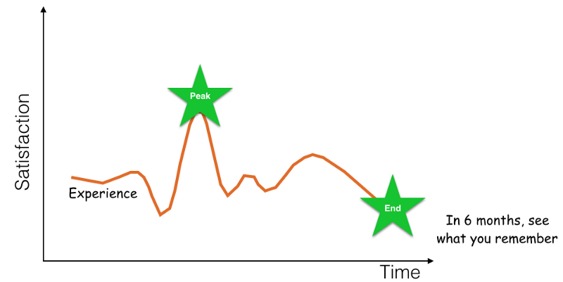
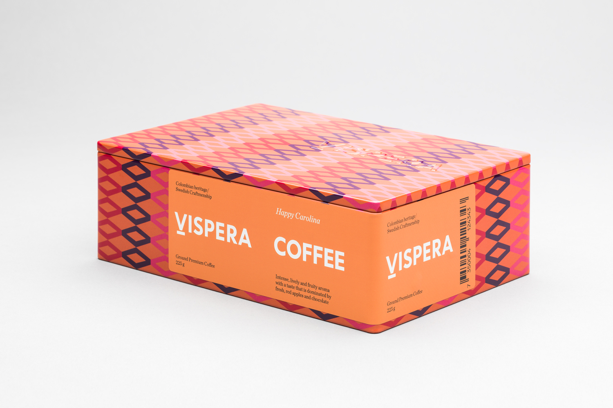

Интересный взгляд на проектирование CJM с точки зрения . Коротко: люди судят об опыте на

Подумать: как определить

wordofmouse

Похоже это особенность мозга давно

[Use this simple psychology rule to improve your customer experience](https://medium.com/@daverothschild/use-this-simple-psychology-rule-to-improve-your-customer-experience-41aa4f3f2124#.bxi0lxfob)

1. People judge an experience by the most **intense** point and the **end** point.
2. The judgement is **not made from the sum** of the entire experience.
3. What if you just focused on the end of the experience and tried to make that great? The checkout experience at a hotel. **What could you do beyond express checkout to make it much better?** What about giving you a bottle of cold water on the way out? Or a snack? What if they took your rental car back for you and just dropped you at the airport?
4. The other thing that Kahneman found was that the length of the experience didn’t matter. He labeled this: **duration neglect**.
5. As you storyboard out the experience for a new innovation, try to identify where a consumer could have a peak experience and how you could amplify it. And, then what delightful and unexpected experience you could provide?
6. [Daniel Kahneman — “When More Pain Is Preferred to Less: Adding a Better End.”](http://brainimaging.waisman.wisc.edu/~perlman/0903-EmoPaper/KahnemanFredricksonSchreiberRedelmeier_1993_WhenMorePainIsPreferredToLess.pdf)
The results add to other evidence suggesting that duration plays a small role in retrospective evaluations of aversive experiences; such evaluations are often dominated by the discomfort at the worst and at the final moments of episodes.

> People judge an experience by the most intense point and the end point.  
> The judgement is not made from the sum of the entire experience.  
[New Packaging for Víspera Coffee by SDL — BP&O](http://bpando.org/2016/12/16/packaging-vispera-coffee/)

#uxdesign